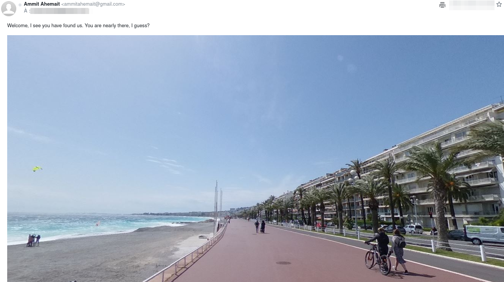

# NEMESIS - HACKTORIA OPERATION

February 12, 2023 Ref : https://hacktoria.com/operations/operation-nemesis/

This WU has been made based on the big work of the [OZINT](https://www.ozint.eu) Team ([Kermit](https://ozint.eu/ozinter/1/), [Degun](https://ozint.eu/ozinter/42/) Alain, [Silverbike](https://ozint.eu/ozinter/13/), [Tartan](https://ozint.eu/ozinter/201/), [CGR](https://ozint.eu/ozinter/66/) and [Tungst](https://ozint.eu/ozinter/102/))

Our main goal is to locate Maksim. We got only a website url : [https://www.ahemait.com](https://www.ahemait.com/)

Answer Instruction :

1 – Figure out the answer to the Operation

2 – Construct the password using instruction below to unlock the “flagfile”

3 – Use the “answer code” from “flagfile” to submit your score via the form below

Password instruction for flagfile, all lowercase: city-country-secretcode

Sample password: rome-italy-555

## The Web Site

The ahemait website contains :

- [Home Page](https://ahemait.com/)
- [Blog](https://ahemait.com/category/blog/)!
- [Images Gallery](https://ahemait.com/images/)
- [Join Us Page](https://ahemait.com/join-us/)
- [About Page](https://dbpedia.org/page/Ammit)

First we can scan for [robots.txt](https://ahemait.com/robots.txt) file in root path

```robots.txt
User-agent: *
Disallow: /wp-admin/
Allow: /wp-admin/admin-ajax.php

User-agent: *
Disallow: /wp-content/uploads/wpo-plugins-tables-list.json
```
Nothing interesting here

On Join Us Page, a twitter account https://twitter.com/ammitahemait89569232. Unfortunately, this account does not exist.

But a [wayback machine query](https://web.archive.org/web/*/https://ahemait.com/join-us/) on this page give us a different point of view :


## The Mail

We can reach the Ahemait by mail with a google mail ammitahemait@gmail.com !



You got Mail !

We got know a photo of a sea frontside.  Reverse image search give a clear result : **La Promenade des Anglais - Nice - France**

But Exif seems to give another location :


Valencia in Spain ?!

Not the same point of view :


Maybe a little rabbit hole ?

A Epieos mail search give this result :


Again, nothing interesting in Maps Contrib and Calendar.

A further look in images gallery give us a little hint :


What is this strange **p** tag ? 

## The Dropbox

Could it be a bit.ly shortener link ?


Let's go to Dropbox


First, let's read the instruction :

```instructions.txt
Welcome to the arm of the righteous.

Begin your journey by proving your skill as a valuable member of Ahemait.  
Find the location below and report there before February 28, 2023.
Use the following code to identify yourself to the opener of the door: 66640777
```

The *recrutment-center.png*


## The German Chase

What we can say about the aerial view (Cursor Color give a hint about the site where it came from : [satellites.pro](https://satellites.pro/))

- It's a green "land" (greener than Valencia)
- Tiles Roofs
- An Antenna in a garden in the center of the view
- A kind of farm at the left
- Several residential building with swimming pool

But we have no information about the country nor the region.

Let's go back to intel info on Hacktoria website.

One of the protagnist of [Ahemait](https://hacktoria.com/ahemait/) organization is **HENDRIK SCHNEIDER**


As the bio said '*Hendrik Schneider grew up as the son of a psychiatrist in the **German state of Bavaria.**'

So we can determine with confidence that the aerial view is over Bavaria in Germany.

Bavaria is quite a big länder with multiple towns.

After running multiple queries on overpass, we were a bit stuck.

Let's have a close look on the farm :


Multiple object with a kind of roof can be located inside a courtyard and outside. May be it could be "Wood Chalets" used for Christmas Market ?

The german translation for "Christmas Market" is **Christkindlmarkt**

Let's make a Google Search for that kind of activity near Munich


A bit guessing, but after hours of try & error, we locate [this](https://www.google.com/maps/place/Christkindlmarkt+von+Unterweikertshofen/@48.3315151,11.2718196,197m/data=!3m1!1e3!4m9!1m2!2m1!1s+Christkindlmarkt!3m5!1s0x479e887a080302a7:0x6337d71d2b775a04!8m2!3d48.3314897!4d11.2731059!15sChBDaHJpc3RraW5kbG1hcmt0WhIiEGNocmlzdGtpbmRsbWFya3SSARBjaHJpc3RtYXNfbWFya2V0mgEjQ2haRFNVaE5NRzluUzBWSlEwRm5TVVF0Y1Y5VFZGbEJFQUXgAQA) !


We found our building, a Christmas tree manufacturer in a small town named **Unterweikertshofen**

Be careful because the Google result give another town result (but it seems to be the main city near the town)

We use the code from instruction text in order to complete the flag.

## The Flag

Final Flag :
**unterweikertshofen-germany-66640777**


