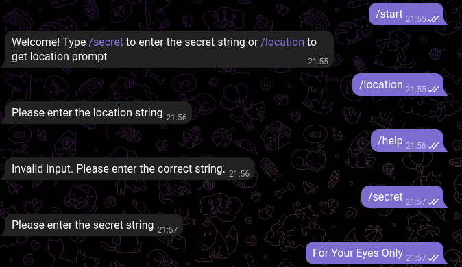
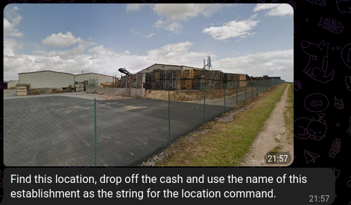
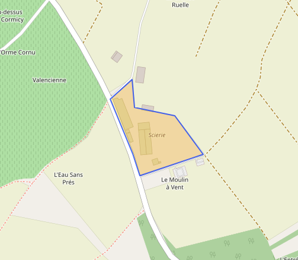
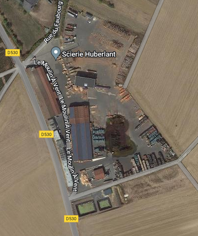
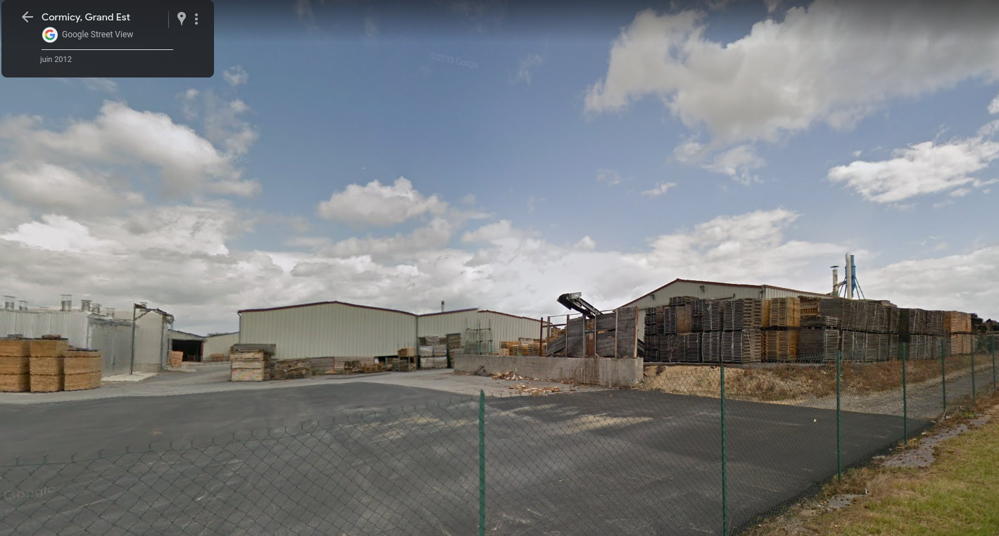
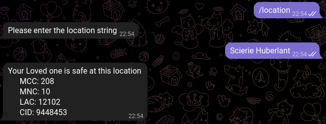
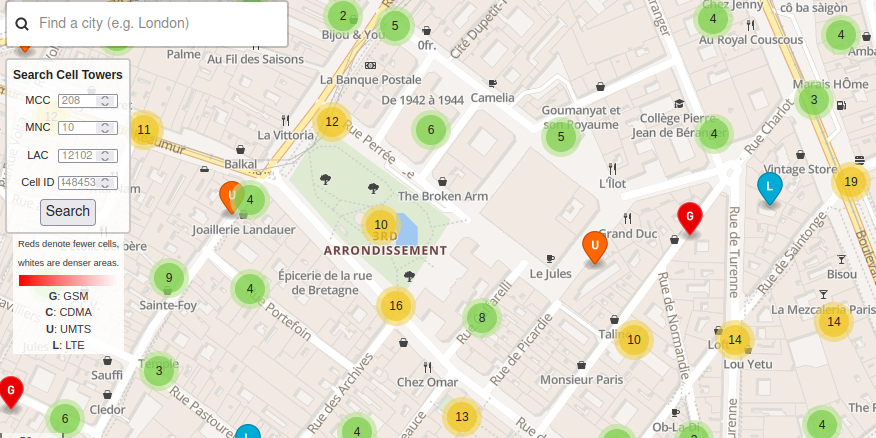
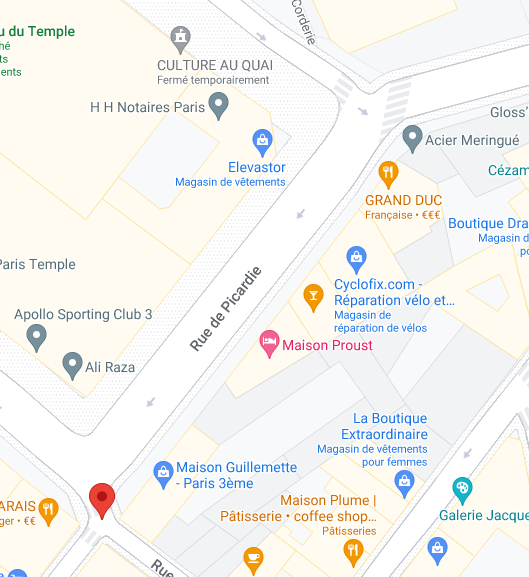

# VALENTINE DAY TRAGEDY - HACKTORIA CONTRACT

February 11, 2023 Ref : https://hacktoria.com/community-contracts/valentines-day-tragedy/
Thanks to @leroux for this Challenge !

The kidnapper of Thalia's beloved has left a encrypted note :

籝籸 类籮籽类籲籮籿籮 籽籱籮 籸籷籮 粂籸籾 籵籸籿籮簵 粂籸籾 籶籾籼籽 籹籪粂 籽籱籮 籹类籲籬籮簷 籝籱籮 籼籾籶 籸籯 鲃簾簵簹簹簹簵簹簹簹 籶籾籼籽 籫籮 籭籮籵籲籿籮类籮籭 籽籸 籾籼 籲籷 籬籪籼籱 籽籸 籽籱籮 籵籸籬籪籽籲籸籷 籼籹籮籬籲籯籲籮籭 籲籷 籽籱籮 籯籸籵籵籸粀籲籷籰 籭籮籽籪籲籵籼 籸籯 籽籱籮 籷籸籽籮簷 籏籪籲籵籾类籮 籽籸 籭籸 籼籸 粀籲籵籵 类籮籼籾籵籽 籲籷 籭籲类籮 籬籸籷籼籮籺籾籮籷籬籮籼簷 籝籸 籹类籸籿籮 粂籸籾类 籬籸籶籶籲籽籶籮籷籽簵 类籮籪籬籱 籸籾籽 籽籸 籾籼 籿籲籪 籸籾类 籝籮籵籮籰类籪籶 籼籮类籿籲籬籮簵 簫籝籱籮籑籲籰籱籐籾籪类籭籨籋籸籽簫 籝籱籮籷 籲籷籹籾籽 籽籱籮 籼籮籬类籮籽 籼籽类籲籷籰 簫籏籸类 籢籸籾类 籎粂籮籼 籘籷籵粂簫 籪籷籭 粂籸籾 粀籲籵籵 籫籮 籰籲籿籮籷 籯籾类籽籱籮类 籲籷籼籽类籾籬籽籲籸籷籼簷 籍籸 籷籸籽 籪籽籽籮籶籹籽 籽籸 籲籷籿籸籵籿籮 籽籱籮 籪籾籽籱籸类籲籽籲籮籼 籸类 粂籸籾类 籵籸籿籮籭 籸籷籮 粀籲籵籵 籼籾籯籯籮类 籽籱籮 籬籸籷籼籮籺籾籮籷籬籮籼簷 籠籮 籪类籮 籪籵粀籪粂籼 粀籪籽籬籱籲籷籰簷 簶籝籱籮 籑籲籰籱 籐籾籪类籭簷

## Message Decoding

A quick analyse with Dcode.fr return a [ROT8000](https://www.dcode.fr/chiffre-rot8000) encoding.

The decoded message is : 

`To retrieve the one you love, you must pay the price. The sum of €5,000,000 must be delivered to us in cash to the location specified in the following details of the note. Failure to do so will result in dire consequences. To prove your commitment, reach out to us via our Telegram service, "TheHighGuard_Bot" Then input the secret string "For Your Eyes Only" and you will be given further instructions. Do not attempt to involve the authorities or your loved one will suffer the consequences. We are always watching. -The High Guard.`

We need to contact a Telegram Bot named **TheHighGuard_Bot**

Two commands are available /location and /secret

The secret is provided in the ROT8000 Message : **For Your Eyes Only**

## The Sawmill

After analysing this Google Street View we can determine :

- It could be a sawmill plant
- A lot of palette are stored outside the building
- A small pathway is running at side of the green fence

The challenge author give an advice on Discord channel about the location : Near Reims in France.

Let's try with overpass turbo !

`[out:json][timeout:25];`

`// gather results`

`(`

`  // query part for: “sawmill”`

`  nwr["craft"="sawmill"]({{bbox}});`

`);`

`// print results`

`out body;`

`>;`

`out skel qt;`

Few result are returned but no match with the sawmill on the photo

Using `  nwr["name"="Scierie"]({{bbox}});` return one correct result :

A sawmill located in Cormicy (Marne) match the photo

The location is [**Scierie Huberlant**](https://goo.gl/maps/88Ya6u5fmPAck8vM7)

## The Cellular Tower 

Let's enter that in Telegram Bot discussion !

We got now a GSM Tower/Cell location 

MCC (**Mobile Country Code**) and MNC (**Mobile Network Code**) refer to SFR Telecom Provider

Using [OpenCellID](https://opencellid.org/) we can locate the mobile tower (BTS)

Location is center of Paris

Finding the address of *Grand Duc Restaurant* give a result :

The beloved is located in *Rue de Picardie Paris*

## The Flag

Password of the zip file is : *Rue_de_Picardie_Paris*

Then you got a beautiful card for your Valentine Day !

